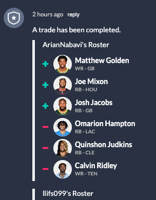

# Week 4

## Week 3 Recap

### The Busted Gazette

You thought week 2 was rough?! Week 3 was even worst, such a rollercoaster of emotions from 10% chance to win; to 99%; to losing. So many slight errors by our players that if we dodged just one we would have won :sob:

We face off against Nino (Michael's Dad) this week and it pains me to root against him but we really need a win to even our record out. We cannot lose to a Dettorre two weeks in a row. Who's next Nono?! get me off this train.

### Trades

Brent Jr has been negotiating some trades but so far nothing has come to fruition but check this :clown: out, get hit with the uno reverse Arian

This just in, I guess any pending trades we had with Arian are off now, so I'm going to put a season long hate watch on his players :facepunch: A lot of Greenbay coming his way so rooting against the cheese heads is fair game now! :cheese: :no_entry_sign:

## Rosters

| **Shareholders**     | **Position** |        **Merivale Maulers** |
| :------------------- | :----------: | --------------------------: |
| J. Daniels - WAS     |    **QB**    |         L. Jackson OB - BAL |
| B. Robinson - ATL    |    **RB**    |        C. McCaffrey RB - SF |
| T. Pollard RB - TEN  |    **RB**    |            J. Cook RB - BUF |
| D. London - ATL      |    **WR**    |          D. Samuel WR - WAS |
| E. Egbuka WR - TB    |    **WR**    |           D. Moore WR - CHI |
| T. McBride - ARI     |    **TE**    |        J. Ferguson TE - DAL |
| R. Pearsall WR - SF  |   **WRT**    |           A. Kamara RB - NO |
| K. Allen WR - LAC    |   **WRT**    |        J. Williams RB - DAL |
| H. Butker K - KC     |    **K**     |           M. Prater K - BUF |
| PHI                  |   **DEF**    |                         BUF |
| D. Prescott QB - DAL |  **BENCH**   |            J. Goff QB - DET |
| N. Chubb RB - HOU    |  **BENCH**   | J. Croskey-Merritt RB - WAS |
| R. Harvey RB - DEN   |  **BENCH**   |          K. Shakir WR - BUF |
| R. Harvey RB - HOU   |  **BENCH**   |        J. Williams WR - DET |
| D. Metcalf - PIT     |  **BENCH**   |         M. Andrews TE - BAL |
| T. Kraft TE - GB     |  **BENCH**   |                         BAL |

## Pick ups and drops

:heavy_plus_sign: R. Harvey RB - HOU

:heavy_minus_sign: T. Tracy - NYG

## Injury report

**Jayden Daniels** did not practice wednesday again this week it's reported that "it's up to the doctors" whether or not he plays on Sunday. Fortunately Dak plays later in the day Sunday so he will be ready to step in if Jayden takes another week off to recover.

**Emeka Egbuka** recovered last week and played about projected so he seems to be back in form.

## Hate and Love Watch

### Love

All but 3 of the current starting line up are playing Sunday 1pm, so if you wanted to cheer the boys on redzone at that time would be the move.

-   **Trey McBride**: Our starting tight end, put up 15 points last week and we're hoping for another 15 this Thursday against the Seahawks.
-   **Keenan Allen**: Sunday 1 pm Keenan is facing off against the 0-3 NY Giants, he's 3 for 3 on 5+ point over performaces this season so he's definitely one of our sleeper players, hopefuly he can keep it up because he's giving us an edge.
-   **Bijan Robinson**: Slight underperformance last week, hopefully he can make up those missing points last week. Another 1pm Sunday player.

### Hate

Nino's also got quite a few players Sunday 1pm (makes sense most games are scheduled then)

-   **Buffalo**: We have no Buffalo players so screw it lets hate the whole team this week, Nino's got their defence and their star running back in James Cook. They play New Orleans Sunday at 1pm.
-   **James Cook**: Plays for Buffalo and remember we aggreed to hate them this week (see above).
-   **Christian McCafferey**: he's put up ovcer 20 points each game so far, we can't have that this week, he didn't practice this Wednesday due to a calf sprain but he's looking good to play this weekend, hopefully their overly cautious and let him relax this Sunday at 4pm.
