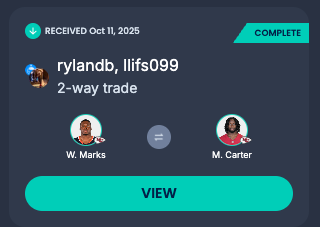

# Week 6

## Week 5 Recap

### The Busted Gazette

Are my words not reaching the correct audience? Dak Prescott putting up 10 points more than our starting peepeepoopoo quarterback. Now I’m going to have to listen to Nedim make fun of me for the next week. PLUS I’m out in the survivor league AND I’m getting chopped from the other league. Not a great week for me.

Our team manager called this a “scheduled loss”, and to be fair it absolutely was, hopefully this week is a scheduled WIN because Colin Macphee has 4 injured players on his bench and Daddy needs to buy a running stroller .

I heard Arian is throwing a big party on the 25th and his hiring dealers to make it a Lac Leamy experience. Maybe we could even convince him to gamble away his players to us or accept a drunk trade 👀

Anyways I’m out of commission for surgery, but hopefully we can do a board game night soon. Love you guys. If I die on the operating table, just know that it was a pleasure being your friend. Take care of Rachel & Rowan, and please don’t let them spend my RRSP on anything besides glizzys & pickles for the ski hill.

Love,

Fresh Prince of Kanata

Editors Note: Unlike our manager I not only picked up dak this week but i fielded him against Matt to show him his true power. W for me, how could he be so foolish.

### Trades

Just in we traded M. Carter for W. Marks, literaly a random pick up last week, hopefully we end up on top because we traded Mike and Leon; and we do not want to lose on a trade with them because we will never hear the end of it. Can't believe they didn't accept our offer of dak last week, it would have won the week of them, instead they lost (keep this in mind for chirping them).

## Rosters

| **Shareholders**     | **Position** |     **Colin Macphee** |
| :------------------- | :----------: | --------------------: |
| D. Prescott QB - DAL |    **QB**    |       B. Nix QB - DEN |
| B. Robinson - ATL    |    **RB**    |     C. Brown RB - CIN |
| T. Pollard RB - TEN  |    **RB**    |  R. Stevenson RB - NE |
| K. Allen WR - LAC    |    **WR**    |  E. Ayomanor WR - TEN |
| D. Metcalf - PIT     |    **WR**    |     P. Nacua WR - LAR |
| T. McBride - ARI     |    **TE**    |      T. Kelce TE - KC |
| D. London - ATL      |   **WRT**    |     K. Pitts TE - ATL |
| E. Egbuka WR - TB    |   **WRT**    |     D. Swift RB - CHI |
| H. Butker K - KC     |    **K**     |      J. Bates K - DET |
| PHI                  |   **DEF**    |                   IND |
| J. Daniels - WAS     |  **BENCH**   |  J. McCarthy QB - MIN |
| W. Marks RB - HOU    |  **BENCH**   |   C. Hubbard RB - CAR |
| R. Pearsall WR - SF  |  **BENCH**   |     C. Godwin WR - TB |
| R. Harvey RB - DEN   |  **BENCH**   |      C. Kirk WR - HOU |
| N. Chubb RB - HOU    |  **BENCH**   |  T. McLaurin WR - WAS |
| T. Kraft TE - GB     |  **BENCH**   | J. Jefferson WR - MIN |

## Pick ups and drops

None

## Injury report

**Ricky Pearsall** Still out, won't be playing this sunday

## Hate and Love Watch

### Love

No thursday night players and just Bijan on Monday.

-   **Dak Prescott**: Finally after weeks of begging we finally are starting this legend, you're welcome Matt, i know you've been dying to see him perform for us.
-   **Bijan Robinson**: Coming off of a bye Bijan faces the bills monday night, hopefully the rest brings us some great performace.
-   **Emeka Egbuka**: He listened and put up 30 points last week, do it again Sunday at 4:35 against the whiners.

### Hate

Ryan's got a bunch of injuries, so we really just need to lock in on hatewatching Pookie, his one all star.

-   **Puka Nacua**: projected for 22 points we could use an underperformance, he hasn't yet scored under 22 points so surely he's due.
-   **Bo Nix**: Ryan's quarterback, projected low, hopefully he underperforms even lower.
-   **Jake Bates**: Running out of people to cheer against so let's pray his kicker misses some kicks or doesn't get the opportunity to score any long ones.
