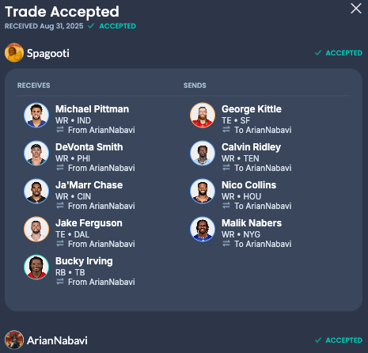

# Week 2

## Week 1 Recap

### The Bust Gazette

Juicy week 1 report for you all. Let’s be honest, we shouldn’t have won week 1, we scraped by beating Julien by 5 points carried by Bijan, Egbuka and Butker, this was a good start to the season. The birds (:horse: :poop: :plate_with_cutlery:) tried to screw us on defence but the rest of the team pulled together to carry them across the finish line. Shout out to AJ Brown his WR1 who scored a whopping fat 1.8 points. We got lucky folks.
Speaking about luck, we are lucky that our shareholder Matt Helmer spoke up about Dak Prescott being an overall garbage pickup. Week 1 shows this QUARTERBACK that scored 7.8 points, good thing he was on the bench, great management Ry! To put this into context, I’d rather have a kicker in our QB spot than let this man have a chance. Happy he is on the bench, but would be even happier see him infiltrate someone else’s team and destroy their passion to play the game.
Next week we play against some dude named LLIFS, who currently has 2 played in a Questionable state. Let’s pray that his players bust harder than the boys in the gondoluzzy.

### League Trades

Devin swore when he threw this into a trade analyzer it said it was in his favor but the league's reaction is he got fleeced, for an uneven numbered trade at leats it was large and not a 2 for 1, either way it'll be fun to watch these players this week to call one of these two managers dumb for making such a bad trade.

## Rosters

| **Shareholders**     | **Position** |             **llifs099** |
| :------------------- | :----------: | -----------------------: |
| J. Daniels - WAS     |    **QB**    |          D. Maye QB - NE |
| B. Robinson - ATL    |    **RB**    |        J. Jacobs RB - GB |
| T. Pollard RB - TEN  |    **RB**    |   Z. Charbonnet RB - SEA |
| R. Pearsall WR - SF  |    **WR**    |         C. Lamb WR - DAL |
| D. Metcalf - PIT     |    **WR**    | J. Smith-Njigba WR - SEA |
| T. McBride - ARI     |    **TE**    |        B. Bowers TE - LV |
| E. Egbuka WR - TB    |   **WRT**    |         C. Olave WR - NO |
| D. London - ATL      |   **WRT**    |     T. McMillan WR - CAR |
| H. Butker K - KC     |    **K**     |       C. Boswell K - PIT |
| PHI                  |   **DEF**    |                       SF |
| D. Prescott QB - DAL |  **BENCH**   |        B. Tuten RB - JAX |
| N. Chubb RB - HOU    |  **BENCH**   |        J. Mixon RB - HOU |
| R. Harvey RB - DEN   |  **BENCH**   |      B. Robinson RB - SF |
| T. Tracy - NYG       |  **BENCH**   |       1. Pacheco RB - KC |
| K. Allen WR - LAC    |  **BENCH**   |          R. Rice WR - KC |
| T. Kraft TE - GB     |  **BENCH**   |        M. Golden WR - GB |

## Pick ups and drops

:heavy_minus_sign: D. Thornton WR - LV
:heavy_minus_sign: B. Allen RB - NYJ
:heavy_plus_sign: Nick Chubb RB - HOU
:heavy_plus_sign: Keenan Allen WR - LV

## Injury report

D. London (shoulder) was limited at Wednesday's practice, Tori McElhaney of the Falcons' official site reports. Surely he's fine simply resting a little but we have two decent subs in Tyrone Tracy and Keenen Allen waiting on the bench to take his place if his questionable mark gets upgraded to out, so althought the injury report isn't clean, there is nothing to worry about.

## Hate and Love Watch

### Love

Prime time baby, this week we've got important players playing in all three prime time games, Thursday, Sunday nights 8:00 PM and Monday at 7pm.

-   **Jayden Daniels**: Our QB plays thursday night, this won't necessarily set the tone of the week as long as he comes close to his projected, i have faith but with the QB we really just have to dodge a really low score, anything near projected will do!
-   **Bijan Robinson**: Did well week one and we look forward to him cutting through the terrible vikings defence sunday night.
-   **Emeka Egbuka**: Another Week 1 performer lets hope for plenty of targets and receptions week 2 to hopefully see him get promotted to WR1.

### Hate

-   **Mike and Leon**: always tying to make a trade they are the loudest managers in the league, we NEED to win against them to use as leverage when the inevitable make a trade offer followed by a "your team sucks, you really need this trade" as they try to gaslight us into something terrible.
-   **Josh Jacobs**: Last week our counter cheering didn't really work on Josh Allen, so this week hopefully Josh Jacobs doesn't do well, we're due. As their highest projected player we could really use an underperformace thursday night!
-   **Jaxon Smith-Njigba**: Sunday 1pm right before Malcolms and Sydney's wedding let's hope he doesn't pop off like week 1, we'll all be spinning terrible towels this blessed sunday.
